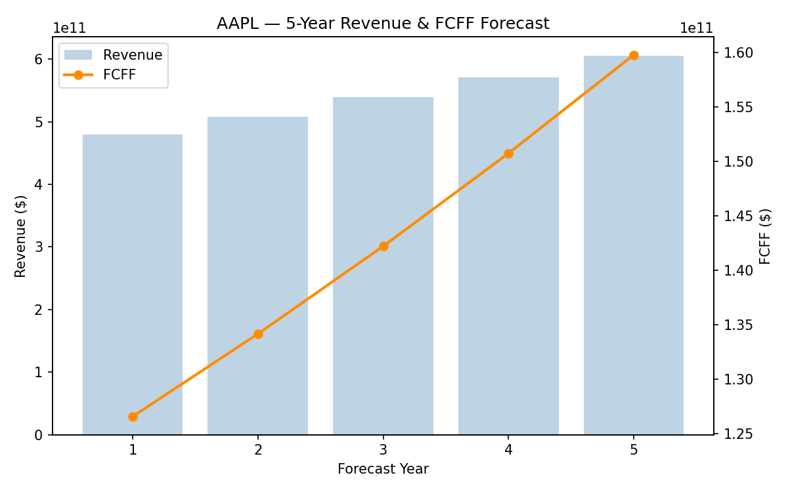
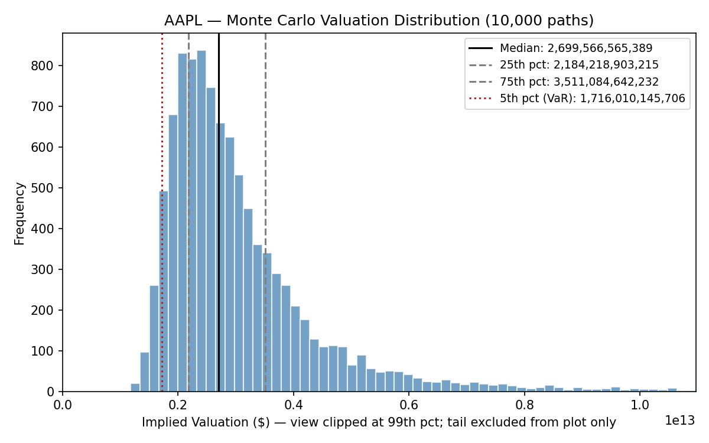
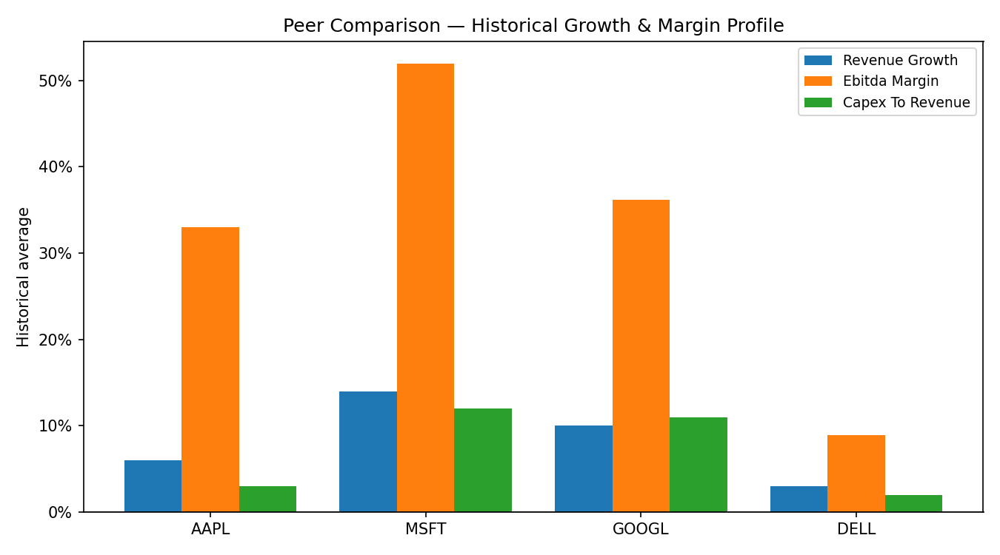

# Valuation Engine

A Python pipeline for pulling company financials and building a discounted cash flow model. Given a ticker and a list of peers, it fetches Income Statement, Balance Sheet, and Cash Flow data through `yfinance`, works out historical margins and growth rates, projects Free Cash Flow to Firm (FCFF) five years out, and runs a Monte Carlo sensitivity check on top of the forecast — then turns the whole thing into charts instead of leaving it as rows in a database.

I put this together to practice building something closer to how a valuation model would actually get assembled at a bank or in equity research — separate stages for data ingestion, valuation math, and output, with results that land in a database instead of just printing to a terminal.

## What it produces

Every run of `main.py` ends by generating three charts from the pipeline's own output tables (`visualize.py` handles this, no manual plotting). These are real, regenerable output — run it against any ticker and they get rebuilt from scratch.

**5-year revenue & FCFF forecast**



Revenue and FCFF projected five years out, holding historical margins at their averages. Bars are revenue, the line is FCFF — shows how much of top-line growth actually turns into free cash.

**Monte Carlo valuation spread**



A single DCF gives you one valuation for one guess at growth and WACC. This runs the Gordon-growth valuation 10,000 times instead, drawing growth and WACC from a normal distribution each pass, and plots the spread — median, 25th/75th percentile, and a rough 5% Value-at-Risk. (View is clipped at the 99th percentile since the tail runs long whenever a draw puts WACC close to growth — the stats themselves reflect the full distribution.)

**Peer comparison**



Revenue growth, EBITDA margin, and CapEx intensity side by side across the ticker universe — a sanity check on whether one company's forecast assumptions look reasonable next to its peers.

## Structure

- `main.py` — entry point; tickers and assumptions live here, and it orchestrates the other modules
- `ingestion.py` — pulls Income Statement, Balance Sheet, and Cash Flow data from yfinance for a target + peer group
- `valuation.py` — the valuation math: historical margins (revenue growth, EBITDA margin, CapEx/revenue, D&A/revenue, working capital swings, tax rate), the FCFF formula applied to both historical actuals and a 5-year forecast, and a Monte Carlo sensitivity check
- `export.py` — writes the resulting tables to SQLite
- `visualize.py` — turns the forecast and Monte Carlo output into the charts above

## Getting started

```bash
pip install -r requirements.txt
python main.py
```

Edit `TARGET_TICKER` and `PEER_TICKERS` at the top of `main.py` first if you want to run it on something other than AAPL/MSFT/GOOGL/DELL. Charts land in `output/charts/`.

Each module can also be run on its own for testing (`python ingestion.py`, `python valuation.py`).

## FCFF formula

```
FCFF = EBIT x (1 - tax rate) + D&A - CapEx + change in NWC
```

FCFF is unlevered cash flow — before any debt or equity financing effects — so it gets discounted at WACC rather than cost of equity when building out the full DCF.

## Output tables

Everything gets written to a SQLite file (`mna_valuation.db`) as long/tidy tables, which made it easy to query and also easy to swap for a real Postgres instance later without touching the calculation code:

| Table | What's in it |
|---|---|
| `company_profiles` | one row per ticker — beta, market cap, sector |
| `raw_financials` | every line item, every period, every ticker |
| `historical_metrics` | the calculated ratios above, by period |
| `fcff_actuals` | reconstructed FCFF from reported numbers |
| `fcff_forecast` | the 5-year projection |
| `risk_simulation` | one row per Monte Carlo run — median/percentile/VaR valuation estimates |

## Why this over just a spreadsheet DCF

Most DCF templates are one static case. This treats growth and WACC as distributions instead of point guesses, and keeps ingestion / valuation math / output as separate modules so the assumptions are easy to swap without touching the calculation logic.

## What's not done yet

WACC estimation, terminal value, and the enterprise-value-to-share-price bridge aren't built yet — the forecast table this produces is meant to feed into that next. Also on the list: sensitivity tables and a proper trading comps cross-check against the peer set.

## Notes

Data comes from Yahoo Finance via yfinance, which is free but occasionally inconsistent — some tickers report line items under different labels, and a few smaller companies are missing fields entirely. Worth double-checking against the actual 10-K before trusting any output for real. Not investment advice, obviously.
