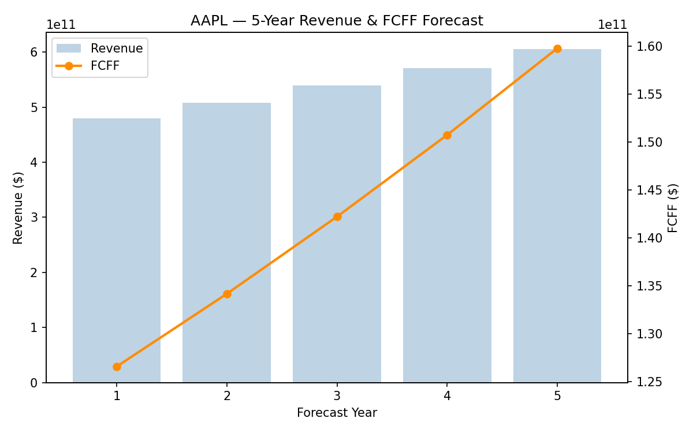
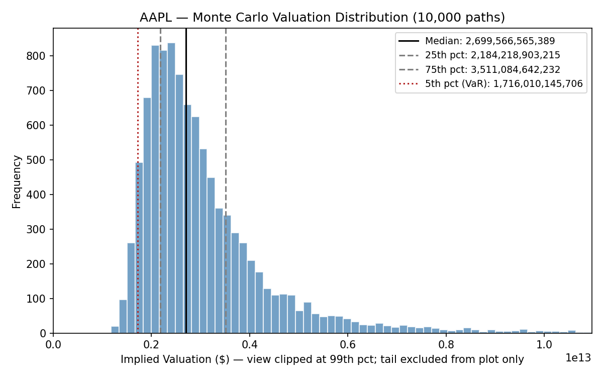
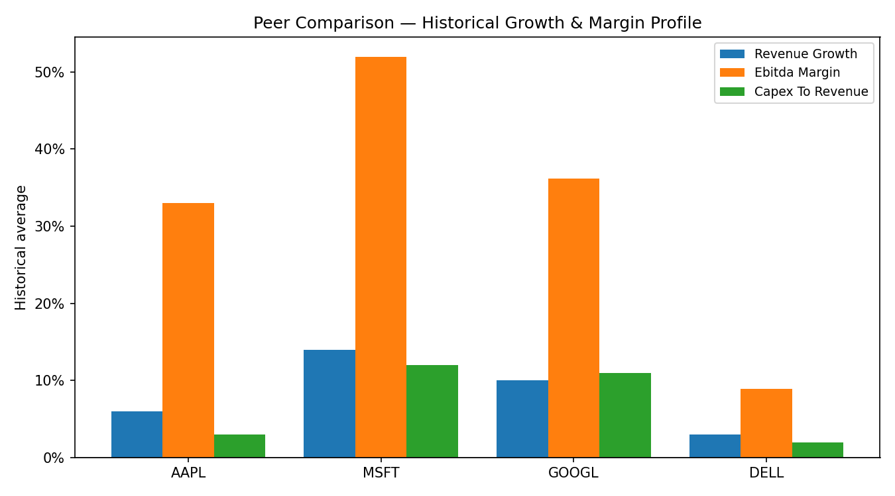

# Deal diligence checker for Indian M&A

Point it at a folder of deal documents (the management deck, the audited Ind AS financial statements and the company's operating model) and it lists the numbers that don't agree, with the exact slide, page or cell behind each one and a question to put to management.

This is the manual job every analyst on an Indian deal ends up doing: the deck says one EBITDA, the audited statements imply another, and the model has a third. The checker does the first pass of that and shows its working so a person can verify every flag.

I'm a student from a small town building this to learn how deals are actually diligenced. It is a prototype tested on invented data, not a product.

## Run it

```
pip install -r requirements.txt
python sample_deal/make_deal.py sample_deal --seed 26
python dealcheck.py sample_deal
```

The sample is a fictional company (Nilgiri Precision Components Limited). Seed 26 plants six problems and the checker finds all six. One of its findings:

> The deck shows net debt of ₹92.80 cr for FY2024 (slide 3) but the audited statements show ₹171.47 cr (p.2). What explains the gap? Ask which debt-like items are in each figure (lease liabilities under Ind AS 116, promoter loans, bill discounting, deferred consideration) and which cash balances count (cash and cash equivalents versus other bank balances and deposits).

Everything it produced is in `output/diligence/`: `report.md`, `findings.csv`, `scenario_summary.png` and `audit_log.jsonl`.

## Built for Indian documents

- Rupee amounts in crore, lakh or million, converted to one unit. The deck can say ₹ Cr while the statements are in lakhs and the model in crore.
- Indian digit grouping (12,34,567.89).
- Indian financial years, April to March, whether written FY24, FY2023-24, 2023-24 or "31 March 2024". Projection columns such as FY25E are ignored rather than flagged as unsupported.
- Schedule III / Ind AS statement layout: expenses by nature, no EBITDA or gross profit line, a note-number column beside the figures, borrowings split into non-current and current. EBITDA, gross margin and net debt are built from the lines that exist and the components are cited.
- Follow-up questions that mention the things that cause these gaps in India: lease liabilities under Ind AS 116, GST, capital work in progress, restricted bank balances, adjusted PAT, order book recognition under Ind AS 115.

## What it checks

- A figure that disagrees with a higher-ranked document. Audited statements are the reference, then the model, then the deck.
- A deck claim that nothing else supports (for example an order book figure).
- A document that contradicts itself: segment note not adding to revenue, a stated EBITDA margin that doesn't match its own EBITDA and revenue.
- Rounding is allowed for. A deck showing ₹812 Cr against ₹812.4 Cr in the statements is not flagged.

Other pieces: an analyst overrides file for numbers the extractor misread (`--overrides overrides.csv`, columns `doc,metric,period,value,unit,reason,analyst`, applied and logged); a hash-chained audit log of each run with the SHA-256 of every input file; and a small DCF that shows what the gap is worth, for example equity value on audited numbers versus the numbers as pitched. WACC (12%) and terminal growth (5%) in that DCF are assumptions I picked, not forecasts, and the output is an illustration rather than a valuation.

## How accurate is it

`eval_checker.py` builds synthetic Indian deal rooms with a random mix of eleven planted problem types and counts a flag as correct when the kind, metric and period match something planted.

| Test | Deals | Planted | Missed | False flags |
|---|---|---|---|---|
| Default | 200 | 980 | 0 | 0 |
| Hard (other label wording, gaps of 1 to 3%, projection columns, correct rounded decoys) | 200 | 980 | 0 | 0 |
| Nothing planted (hard layout) | 200 | 0 | n/a | 0 |

Read this carefully. I wrote the generator and the checker, and the generator produces documents laid out the way the extractor expects, so a perfect score shows the logic is sound and does not show it will cope with a real data room. The number I don't have yet is how it does on real, messy documents.

## Limits

- Synthetic data only. No real company's documents have been used.
- Extraction is label and pattern based. Different layouts, merged cells, figures in footnotes, scanned PDFs (there is no OCR), and spreadsheets with formulas that have no saved values will be missed or misread. "No finding" does not mean "checked".
- It does not understand definitions. "Adjusted EBITDA" with add-backs, EBITDA including other income, or a different net debt definition will show up as a mismatch; the follow-up question is how an analyst resolves it.
- Gross margin is computed as revenue less cost of materials consumed. A company that reports differently needs a different definition.
- Consolidated and standalone statements are not told apart.
- It is a tool for an analyst to look at, not something that decides anything, and nothing here is investment or legal advice.

## Using it on a live deal

Not without the firm's own controls. Running locally is not the same as being approved. At minimum that means sign-off from the firm's information security and compliance teams, access limited to the deal team, encryption at rest, a firm-approved environment, and review of the audit log. For a listed target, deal documents can be unpublished price sensitive information under SEBI's insider trading regulations, which the firm's own policies will already cover. The hash-chained log here is a starting point and not a replacement for any of that. The checker makes no network calls and has no LLM in the checking path; the follow-up questions are templates.

## Valuation pipeline

This repo started as a public-company valuation pipeline: it pulls Income Statement, Balance Sheet and Cash Flow data through yfinance for a target and peers, projects free cash flow to the firm five years out, and runs a Monte Carlo on growth and WACC.

```
python main.py
```

Set `TARGET_TICKER` and `PEER_TICKERS` at the top of `main.py`. The charts below were produced with US tickers because that is what I could run when I built it. yfinance does carry NSE tickers (the `.NS` suffix) but I have not run this pipeline on them, so I am not claiming it works for Indian companies yet. That is next.







FCFF = EBIT x (1 - tax rate) + D&A - CapEx + change in NWC. The Monte Carlo draws growth and WACC from normal distributions over 10,000 Gordon-growth valuations; the chart is clipped at the 99th percentile because the tail runs long when a draw puts WACC near growth. Files: `main.py`, `ingestion.py`, `valuation.py`, `export.py` (SQLite tables), `visualize.py`. Yahoo Finance data is free but inconsistent, so check against the annual report before trusting an output.

## Not built yet

Running the valuation pipeline on NSE-listed companies, a trading comps cross-check, consolidated versus standalone handling, support for messier real documents, and testing on real (permitted) deal documents.

## Layout

```
dealcheck.py          run the diligence check
eval_checker.py       accuracy test on synthetic deals
diligence/            extract, reconcile, report, scenarios, audit
sample_deal/          synthetic deal room and its generator
main.py ...           valuation pipeline
```
